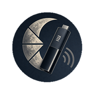
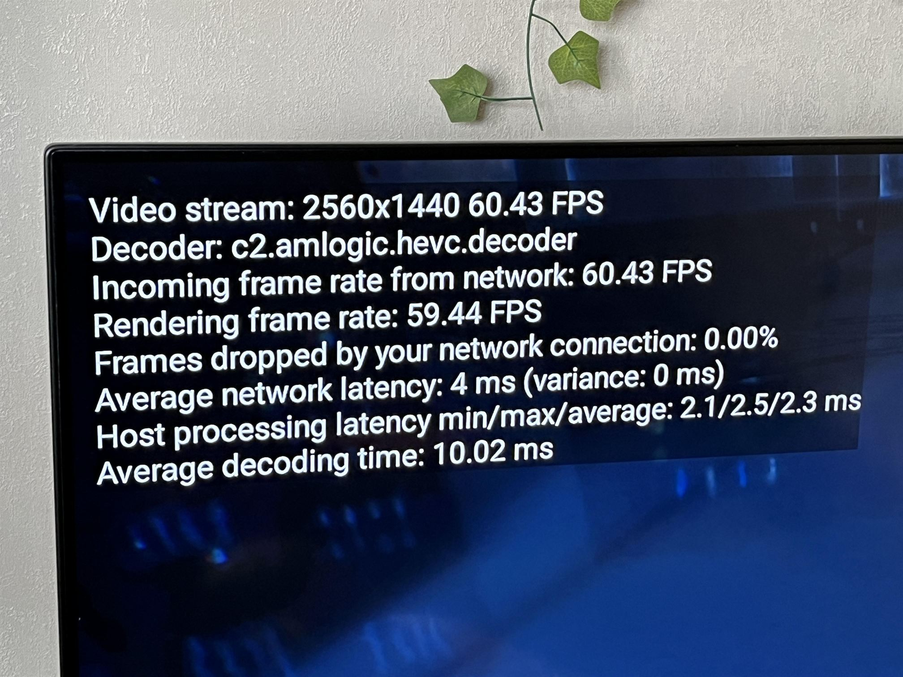

  

<strong>Форк Moonlight Android для Mi TV Stick 4K Gen 2/Gen 1</strong>

# Форк Moonlight Android для Mi TV Stick 4K Gen 2/Gen 1

English version: [README.md](README.md)

Этот репозиторий — форк **Moonlight Android** с исправлениями под **Mi TV Stick 4K Gen 2 и Gen 1**, в основном для:

- стабильности/совместимости HEVC-стриминга
- поведения GPU composition на Android TV

## Что изменено в этом форке

Форк включает патчи в следующих областях:

- обработка HEVC low-latency параметров декодера на затронутых устройствах Xiaomi/Amlogic
- настройка поведения HEVC decoder/RFI для Android TV
- логика форсирования GPU composition для уменьшения сценариев со статтерами на TV stick
- дополнительные улучшения рендера и frame pacing

## Скачать

Приложение можно скачать на странице [Releases](https://github.com/farnsworth3010/moonlight-android-mi-tv-stick-gen-2/releases).

Бинарный APK собирается внутри GitHub Actions workflow, поэтому процесс сборки прозрачный и воспроизводимый.

## Инструкция по сборке

1. Установите зависимости:
   - Android Studio
   - Android NDK
2. Клонируйте репозиторий.
3. Инициализируйте submodules:
   - `git submodule update --init --recursive`
4. Создайте `local.properties` в корне репозитория и укажите путь к NDK:
   - `ndk.dir=...`
5. Откройте проект в Android Studio (или используйте Gradle).
6. Соберите APK:
   - Android Studio: **Build > Build APK(s)**
   - или CLI: `./gradlew :app:assembleDebug` (Windows: `gradlew.bat :app:assembleDebug`)

## Настройки по умолчанию в этом форке

Текущие значения по умолчанию настроены под целевой профиль устройства:

- Разрешение: **Full HD (1920x1080)**
- Предпочтительный кодек: **HEVC**
- Frame pacing: **Balanced**
- Android TV force GPU composition: **Включено**

## Протестированная конфигурация

Проверено на:

- Устройство: **Mi TV Stick 4K Gen 2**
- Профиль стриминга: **2K 60 FPS**
- Frame pacing: **Balanced**
- Тестирование выполнялось с использованием **[Vibepollo](https://github.com/Nonary/Vibepollo)**

Режим low-latency на некоторых затронутых конфигурациях может вызывать фризы.

## Известные проблемы

- Стриминг всё ещё может зависнуть в случайный момент (точная причина не установлена).
- Плавность может ухудшаться при включённом большом оверлее статистики производительности.

## Рекомендации по настройкам ТВ

Для уменьшения задержки рекомендуется:

- Включить **Game Mode** на телевизоре.
- Выключить **Auto Motion Plus** (или аналогичные функции интерполяции/сглаживания движения).

## Вклад в проект

Issues и pull requests приветствуются.

Если вы воспроизвели фризы/зависания, пожалуйста, приложите:

- модель устройства (`Build.MODEL` / `Build.DEVICE`)
- название декодера
- настройки кодека/разрешения/FPS/frame pacing
- короткую последовательность воспроизведения проблемы

## Благодарности

- [Moonlight Android](https://github.com/moonlight-stream/moonlight-android)
- [Sunshine](https://github.com/LizardByte/Sunshine)
- [Vibepollo](https://github.com/Nonary/Vibepollo)
- [Nun-z/moonlight-android](https://github.com/Nun-z/moonlight-android)
- [Viktsolovevwork278/moonlight-android-hevc-fix](https://github.com/Viktsolovevwork278/moonlight-android-hevc-fix)

## Примечание о разработке

При разработке использовался GitHub Copilot.  
Все итоговые изменения были вручную проверены и протестированы человеком.
